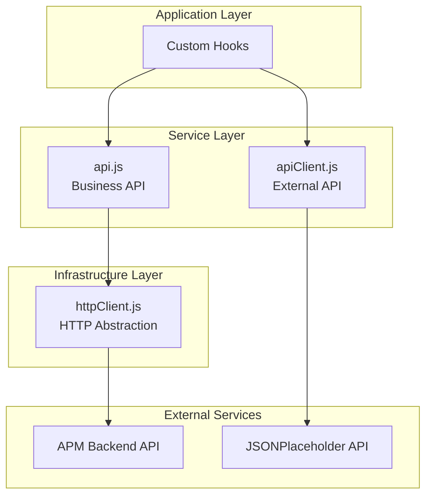
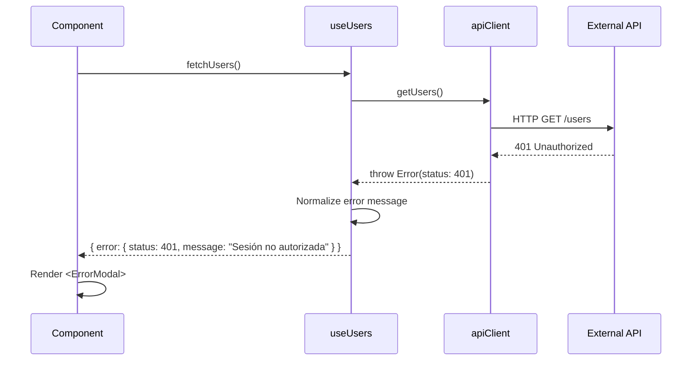
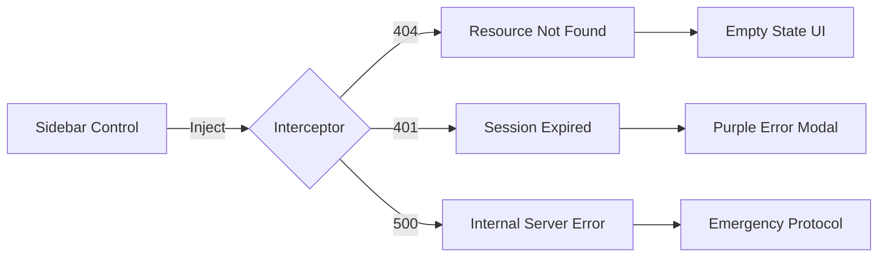

## Service Layer Architecture

APM Enterprise implements a **three-tier service architecture** that abstracts external communication, normalizes responses, and provides centralized error handling.



## HTTP Client

Base HTTP abstraction layer for internal API communication.

**Source**: `src/services/httpClient.js:1-63`

<CodeGroup>
```js Implementation
const BASE_URL = "https://api.apm-enterprise.com/v1";

async function handleResponse(response) {
    if (!response.ok) {
        const errorData = await response.json().catch(() => ({}));
        const error = new Error(
            errorData.message || "Error de comunicación con el servidor"
        );
        error.status = response.status;
        throw error;
    }
    return response.json();
}

const getHeaders = (extraHeaders = {}) => ({
    'Content-Type': 'application/json',
    'Authorization': 'Bearer demo-token',
    ...extraHeaders,
});

export const httpClient = {
    async get(endpoint, options = {}) {
        const response = await fetch(`${BASE_URL}${endpoint}`, {
            method: 'GET',
            headers: getHeaders(options.headers),
        });
        return handleResponse(response);
    },

    async post(endpoint, data, options = {}) {
        const response = await fetch(`${BASE_URL}${endpoint}`, {
            method: 'POST',
            headers: getHeaders(options.headers),
            body: JSON.stringify(data),
        });
        return handleResponse(response);
    },

    async put(endpoint, data, options = {}) {
        const response = await fetch(`${BASE_URL}${endpoint}`, {
            method: 'PUT',
            headers: getHeaders(options.headers),
            body: JSON.stringify(data),
        });
        return handleResponse(response);
    },

    async patch(endpoint, data, options = {}) {
        const response = await fetch(`${BASE_URL}${endpoint}`, {
            method: 'PATCH',
            headers: getHeaders(options.headers),
            body: JSON.stringify(data),
        });
        return handleResponse(response);
    },

    async delete(endpoint, options = {}) {
        const response = await fetch(`${BASE_URL}${endpoint}`, {
            method: 'DELETE',
            headers: getHeaders(options.headers),
        });
        return handleResponse(response);
    }
};
```

```js Usage Example
import { httpClient } from "./httpClient";

// GET request
const users = await httpClient.get("/users");

// POST with custom headers
const project = await httpClient.post(
    "/projects",
    { name: "New Project", owner: "Carlos" },
    { headers: { 'X-Custom': 'value' } }
);

// PATCH request
const updated = await httpClient.patch(
    `/projects/${id}/toggle`,
    {},
    { headers: { Authorization: `Bearer ${token}` } }
);
```
</CodeGroup>

### Key Features

<Tabs>
  <Tab title="Centralized Config">
    Base URL and default headers are configured once:
    ```js
    const BASE_URL = "https://api.apm-enterprise.com/v1";
    const getHeaders = () => ({
        'Content-Type': 'application/json',
        'Authorization': 'Bearer demo-token',
    });
    ```
    Change the API domain in one place, not hundreds.
  </Tab>
  
  <Tab title="Error Normalization">
    All HTTP errors are normalized to a consistent format:
    ```js
    async function handleResponse(response) {
        if (!response.ok) {
            const error = new Error("Error message");
            error.status = response.status;  // Always include status
            throw error;
        }
        return response.json();
    }
    ```
    Hooks can reliably access `error.status` and `error.message`.
  </Tab>
  
  <Tab title="Method Abstraction">
    RESTful methods abstracted into simple functions:
    ```js
    // Instead of:
    fetch('/api/users', { method: 'GET', headers: {...} })
    
    // Write:
    httpClient.get('/users')
    ```
  </Tab>
</Tabs>

## Business API Service

Application-specific API functions for internal backend.

**Source**: `src/services/api.js:1-28`

```js Implementation
import { httpClient } from "./httpClient";

export async function apiGetDashboard({ token }) {
    const response = await httpClient.get("/dashboard", {
        headers: { Authorization: `Bearer ${token}` }
    });
    await new Promise(resolve => setTimeout(resolve, 1000));
    return response;
}

export async function apiCreateProject({ token, payload }) {
    return httpClient.post("/projects", payload, {
        headers: { Authorization: `Bearer ${token}` }
    });
}

export async function apiToggleProjectStatus({ token, id }) {
    return httpClient.patch(`/projects/${id}/toggle`, {}, {
        headers: { Authorization: `Bearer ${token}` }
    });
}

export async function apiUpdateProject({ token, id, payload }) {
    return httpClient.put(`/projects/${id}`, payload, {
        headers: { Authorization: `Bearer ${token}` }
    });
}
```

### Usage in Hooks

**Source**: `src/hooks/useDashboard.js:14-21`

```js Integration with useFetch
import { apiGetDashboard } from "../services/api";
import { useFetch } from "./useFetch";

export function useDashboard() {
    const [token, setToken] = useState("demo-token");
    
    // useFetch calls apiGetDashboard automatically
    const { data, loading, error } = useFetch(
        () => apiGetDashboard({ token }),
        !!token,  // only execute if token exists
        [token]   // re-fetch when token changes
    );
    
    return { data, loading, error };
}
```

<Note>
  Notice the clean separation: `api.js` knows about endpoints, `httpClient.js` knows about HTTP, and hooks know about state. Each layer has a single responsibility.
</Note>

## External API Client

Service for third-party API integration (JSONPlaceholder).

**Source**: `src/services/apiClient.js:1-37`

```js Implementation
const USERS_BASE_URL = "https://jsonplaceholder.typicode.com";

export const apiClient = {
    async getUsers() {
        try {
            const response = await fetch(`${USERS_BASE_URL}/users`);
            if (!response.ok) {
                const error = new Error("Error al obtener usuarios");
                error.status = response.status;
                throw error;
            }
            const data = await response.json();
            console.log("Users Data:", data);
            return data;
        } catch (err) {
            throw err;
        }
    },

    async getUserPosts(userId) {
        const response = await fetch(
            `${USERS_BASE_URL}/posts?userId=${userId}`
        );
        if (!response.ok) {
            throw new Error("Error al obtener posts");
        }
        const data = await response.json();
        console.log(`Posts (User ${userId}):`, data);
        return data;
    },

    async getPostComments(postId) {
        const response = await fetch(
            `${USERS_BASE_URL}/comments?postId=${postId}`
        );
        if (!response.ok) {
            throw new Error("Error al obtener comentarios");
        }
        const data = await response.json();
        console.log(`Comments (Post ${postId}):`, data);
        return data;
    }
};
```

### Silent Logging Pattern

The external API client includes **silent logging** for technical auditing:

```js
console.log("Users Data:", data);
console.log(`Posts (User ${userId}):`, data);
console.log(`Comments (Post ${postId}):`, data);
```

This creates **browser console audit trails** without cluttering the UI.

<Tip>
  Press F12 to open the browser console and see grouped logs showing all API activity - perfect for debugging and technical audits without affecting UX. The console displays user posts, comments, and other API data in organized groups.
</Tip>

### Usage in Hooks

**Source**: `src/hooks/useUsers.js:12-32`

```js Integration Example
import { apiClient } from "../services/apiClient";

export function useUsers() {
    const [users, setUsers] = useState([]);
    const [loading, setLoading] = useState(false);
    const [error, setError] = useState(null);

    const fetchUsers = useCallback(async () => {
        setLoading(true);
        setError(null);
        try {
            const data = await apiClient.getUsers();
            await new Promise(resolve => setTimeout(resolve, 1000));
            setUsers(data);
        } catch (err) {
            setUsers([]);
            const msg = err.status === 404 ? "Usuario no encontrado" :
                err.status === 401 ? "Sesión no autorizada" :
                (err.message || "Falla de auditoría de red");
            setError({
                status: err.status || 500,
                message: msg
            });
        } finally {
            setLoading(false);
        }
    }, []);

    return { users, loading, error, fetchUsers };
}
```

## Error Handling Flow

APM Enterprise implements a **cascading error handling system**:



### Error Transformation

Errors are transformed at each layer:

<Steps>
  <Step title="Server Response">
    Raw HTTP error:
    ```
    401 Unauthorized
    { "error": "Invalid token" }
    ```
  </Step>
  
  <Step title="httpClient Normalization">
    Converted to Error object:
    ```js
    const error = new Error("Error de comunicación");
    error.status = 401;
    throw error;
    ```
  </Step>
  
  <Step title="Hook Transformation">
    Mapped to user-friendly message:
    ```js
    const msg = err.status === 401 
        ? "Sesión no autorizada" 
        : "Falla de auditoría";
    setError({ status: 401, message: msg });
    ```
  </Step>
  
  <Step title="UI Display">
    Visual error modal:
    ```jsx
    {error && (
        <ErrorModal 
            status={error.status} 
            message={error.message} 
        />
    )}
    ```
  </Step>
</Steps>

## Network Failure Simulator

Phase 3 includes a **network failure simulator** for resilience testing:

**Source**: Referenced in `FASE_3_PREMIUM.md:31-43`



### Simulated Error Codes

<CardGroup cols={3}>
  <Card title="404 Not Found" icon="circle-question">
    Triggers empty state UI with "Resource not found" message.
  </Card>
  <Card title="401 Unauthorized" icon="lock">
    Shows purple modal: "Sesión no autorizada"
  </Card>
  <Card title="500 Server Error" icon="triangle-exclamation">
    Activates emergency protocol with retry logic.
  </Card>
</CardGroup>

## API Integration Pattern

The recommended pattern for adding new API endpoints:

<Steps>
  <Step title="Add to httpClient or apiClient">
    ```js services/api.js
    export async function apiGetProjects({ token }) {
        return httpClient.get("/projects", {
            headers: { Authorization: `Bearer ${token}` }
        });
    }
    ```
  </Step>
  
  <Step title="Create Custom Hook">
    ```js hooks/useProjects.js
    import { useFetch } from "./useFetch";
    import { apiGetProjects } from "../services/api";
    
    export function useProjects(token) {
        return useFetch(
            () => apiGetProjects({ token }),
            !!token,
            [token]
        );
    }
    ```
  </Step>
  
  <Step title="Use in Component">
    ```jsx pages/ProjectsPage.jsx
    import { useProjects } from "../hooks/useProjects";
    
    function ProjectsPage() {
        const { data, loading, error } = useProjects("token");
        
        if (loading) return <Skeleton />;
        if (error) return <ErrorMessage {...error} />;
        
        return <ProjectList projects={data} />;
    }
    ```
  </Step>
</Steps>

## Benefits

<AccordionGroup>
  <Accordion title="Single Source of Truth">
    API configuration lives in one place. Change the base URL once, not in every component.
  </Accordion>

  <Accordion title="Consistent Error Handling">
    All errors follow the same structure: `{ status: number, message: string }`. UI can reliably handle any error.
  </Accordion>

  <Accordion title="Easy Testing">
    Mock the service layer, not individual fetch calls:
    ```js
    jest.mock('../services/api', () => ({
        apiGetDashboard: jest.fn(() => Promise.resolve(mockData))
    }));
    ```
  </Accordion>

  <Accordion title="Type Safety Ready">
    Easy to add TypeScript:
    ```ts
    interface Project {
        id: string;
        name: string;
        owner: string;
        budget: number;
    }
    
    export async function apiGetProjects(): Promise<Project[]> {
        return httpClient.get("/projects");
    }
    ```
  </Accordion>
</AccordionGroup>

## Next Steps

<CardGroup cols={2}>
  <Card title="Custom Hooks" icon="link" href="/architecture/custom-hooks">
    Learn how hooks consume these API services
  </Card>
  <Card title="Architecture Overview" icon="sitemap" href="/architecture/overview">
    See how the API layer fits into the full architecture
  </Card>
</CardGroup>