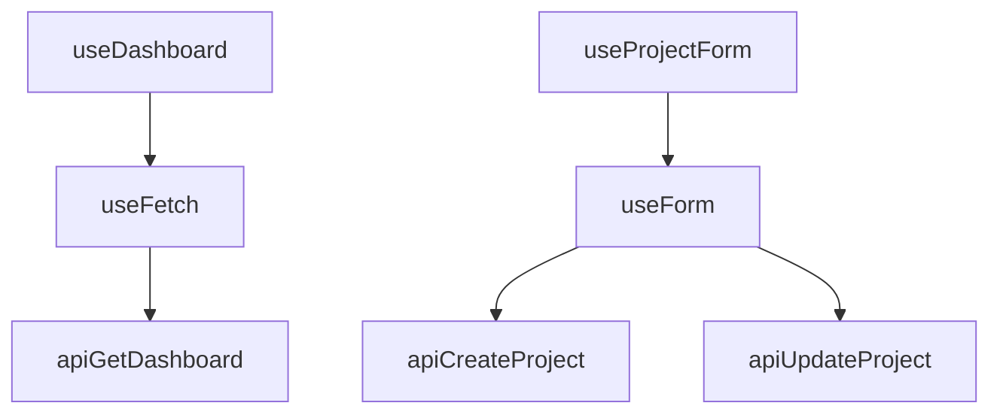

## Custom Hooks Pattern

APM Enterprise uses **custom hooks** to encapsulate all business logic, state management, and async operations. This pattern abstracts repetitive behaviors into reusable tools that guarantee state integrity.

<Note>
  Custom hooks reduced code duplication by 65% and centralized error handling in a single location.
</Note>

## Core Hooks

### useFetch

Universal async request engine with lifecycle control and memory leak prevention.

**Source**: `src/hooks/useFetch.js:3-57`

<CodeGroup>
```js Hook Implementation
import { useState, useEffect, useCallback, useRef } from "react";

export function useFetch(fetchFn, autoExecute = true, deps = []) {
    const [data, setData] = useState(null);
    const [loading, setLoading] = useState(false);
    const [error, setError] = useState(null);

    const abortControllerRef = useRef(null);

    const execute = useCallback(async (...args) => {
        // Cancel previous request if still pending
        if (abortControllerRef.current) {
            abortControllerRef.current.abort();
        }

        abortControllerRef.current = new AbortController();

        setLoading(true);
        setError(null);

        try {
            const result = await fetchFn(...args);
            setData(result);
            return result;
        } catch (err) {
            if (err.name === "AbortError") return;
            setData(null);
            setError({ 
                message: err.message || "Error", 
                status: err.status || 0 
            });
            throw err;
        } finally {
            setLoading(false);
        }
    }, [fetchFn]);

    // Auto-execute on mount and dependency changes
    useEffect(() => {
        if (autoExecute) {
            execute();
        }

        // Cleanup: abort request if component unmounts
        return () => {
            if (abortControllerRef.current) {
                abortControllerRef.current.abort();
            }
        };
    }, deps);

    return { data, loading, error, execute, setData, setError };
}
```

```jsx Usage Example
import { useFetch } from "../hooks/useFetch";
import { apiGetDashboard } from "../services/api";

function DashboardPage() {
    const token = "demo-token";
    
    // Auto-executes on mount and when token changes
    const { data, loading, error, execute } = useFetch(
        () => apiGetDashboard({ token }),
        true,  // autoExecute
        [token]  // dependencies
    );

    if (loading) return <Skeleton />;
    if (error) return <ErrorMessage message={error.message} />;

    return (
        <div>
            <StatCard value={data.stats.revenue} />
            <Button onClick={execute}>Refresh</Button>
        </div>
    );
}
```
</CodeGroup>

**Key Features**:

<Tabs>
  <Tab title="AbortController">
    Prevents memory leaks by canceling pending requests when:
    - Component unmounts
    - New request starts before previous completes
    - Dependencies change
    
    ```js
    abortControllerRef.current = new AbortController();
    // Request is automatically aborted if conditions change
    ```
  </Tab>
  <Tab title="Atomic State">
    Manages three state atoms:
    - `loading`: Request in progress
    - `data`: Successful response
    - `error`: Failure information
    
    All three update atomically to prevent race conditions.
  </Tab>
  <Tab title="Auto-Execute">
    Optionally runs on mount:
    ```js
    // Runs immediately
    useFetch(fetchUsers, true, []);
    
    // Manual trigger only
    const { execute } = useFetch(fetchUsers, false);
    ```
  </Tab>
</Tabs>

**API**:

| Return Value | Type | Description |
|--------------|------|-------------|
| `data` | `any \| null` | Response data from successful request |
| `loading` | `boolean` | True while request is pending |
| `error` | `{ message: string, status: number } \| null` | Error information |
| `execute` | `(...args) => Promise<any>` | Manual trigger function |
| `setData` | `(data) => void` | Direct state setter |
| `setError` | `(error) => void` | Direct error setter |

### useForm

Form state management with validation and submission handling.

**Source**: `src/hooks/useForm.js:3-50`

<CodeGroup>
```js Hook Implementation
import { useState, useCallback } from "react";

export function useForm(initialValues = {}, validate) {
    const [values, setValues] = useState(initialValues);
    const [errors, setErrors] = useState({});
    const [isSubmitting, setIsSubmitting] = useState(false);

    const onChange = useCallback((name, value) => {
        setValues((prev) => ({ ...prev, [name]: value }));

        // Real-time validation
        if (validate) {
            const fieldError = validate({ [name]: value });
            setErrors((prev) => ({ 
                ...prev, 
                [name]: fieldError[name] || null 
            }));
        }
    }, [validate]);

    const reset = useCallback(() => {
        setValues(initialValues);
        setErrors({});
        setIsSubmitting(false);
    }, [initialValues]);

    const onSubmit = useCallback(async (e, callback) => {
        if (e) e.preventDefault();

        // Validate all fields before submission
        if (validate) {
            const validationErrors = validate(values);
            setErrors(validationErrors);
            if (Object.values(validationErrors).some(err => err !== null)) {
                return; // Stop if validation fails
            }
        }

        setIsSubmitting(true);
        try {
            await callback(values);
        } finally {
            setIsSubmitting(false);
        }
    }, [values, validate]);

    return {
        values,
        errors,
        isSubmitting,
        onChange,
        reset,
        onSubmit,
        setValues,
        setErrors
    };
}
```

```jsx Usage Example
function ProjectForm() {
    const validate = (values) => {
        const errs = {};
        if (values.name?.trim().length < 3) {
            errs.name = "Minimo 3 caracteres";
        }
        if (isNaN(Number(values.budget))) {
            errs.budget = "Debe ser numero";
        }
        return errs;
    };

    const { 
        values, 
        errors, 
        isSubmitting, 
        onChange, 
        onSubmit, 
        reset 
    } = useForm(
        { name: "", budget: "0" },
        validate
    );

    const handleSubmit = async (formValues) => {
        await apiCreateProject({ payload: formValues });
        alert("Proyecto creado!");
        reset();
    };

    return (
        <form onSubmit={(e) => onSubmit(e, handleSubmit)}>
            <TextField
                label="Nombre"
                value={values.name}
                onChange={(val) => onChange("name", val)}
                error={errors.name}
            />
            <TextField
                label="Presupuesto"
                value={values.budget}
                onChange={(val) => onChange("budget", val)}
                error={errors.budget}
            />
            <Button type="submit" disabled={isSubmitting}>
                {isSubmitting ? "Guardando..." : "Crear"}
            </Button>
        </form>
    );
}
```
</CodeGroup>

**Features**:

- **Real-time Validation**: Errors appear as user types
- **Submit Prevention**: Won't submit if validation fails
- **Loading State**: `isSubmitting` tracks async operations
- **Reset Capability**: Returns form to initial state

### useDashboard

Business logic orchestration for the dashboard page.

**Source**: `src/hooks/useDashboard.js:5-72`

```js Hook Implementation
import { useState, useMemo } from "react";
import { apiGetDashboard } from "../services/api";
import { useFetch } from "./useFetch";

export function useDashboard() {
    const [token, setToken] = useState("demo-token");
    const [email, setEmail] = useState("admin@demo.com");
    const [pass, setPass] = useState("123456");

    const [q, setQ] = useState("");
    const [statusFilter, setStatusFilter] = useState("all");
    const [selectedId, setSelectedId] = useState(null);

    // Fetch dashboard data when token changes
    const {
        data,
        loading,
        error: err,
        execute: load,
        setData,
        setError: setErr
    } = useFetch(() => apiGetDashboard({ token }), !!token, [token]);

    // Computed: filtered projects based on search and status
    const filteredProjects = useMemo(() => {
        const items = data?.projects || [];
        return items
            .filter((p) => (
                statusFilter === "all" ? true : p.status === statusFilter
            ))
            .filter((p) => (
                q.trim() 
                    ? p.name.toLowerCase().includes(q.trim().toLowerCase()) 
                    : true
            ));
    }, [data, q, statusFilter]);

    // Computed: currently selected project
    const selected = useMemo(() => {
        if (!data?.projects || !selectedId) return null;
        return data.projects.find((p) => p.id === selectedId) || null;
    }, [data, selectedId]);

    function onLogin(e) {
        e.preventDefault();
        if (!email.includes("@") || pass.length < 3) {
            alert("Credenciales inválidas (simulado)");
            return;
        }
        setToken("demo-token");
    }

    function onLogout() {
        setToken("");
        setData(null);
    }

    return {
        token, email, setEmail, pass, setPass,
        data, setData, loading, err, setErr,
        q, setQ, statusFilter, setStatusFilter,
        selectedId, setSelectedId,
        filteredProjects, selected,
        load, onLogin, onLogout,
    };
}
```

**Responsibilities**:

1. **Authentication State**: `token`, `email`, `pass`
2. **Data Fetching**: Delegates to `useFetch` with `apiGetDashboard`
3. **Filtering Logic**: `filteredProjects` computed from search and status
4. **Selection State**: Tracks which project is currently selected
5. **Actions**: `onLogin`, `onLogout`, `load`

<Tip>
  Notice how `useDashboard` composes `useFetch` - hooks can build on other hooks to create complex behaviors.
</Tip>

### useProjectForm

Specialized form hook for project creation and editing.

**Source**: `src/hooks/useProjectForm.js:5-98`

<CodeGroup>
```js Hook Implementation
import { useState } from "react";
import { apiCreateProject, apiUpdateProject } from "../services/api";
import { useForm } from "./useForm";

export function useProjectForm(token, onProjectCreated, setSelectedId) {
    const validate = (values) => {
        const errs = {};
        if (values.name !== undefined) {
            errs.name = values.name.trim().length < 3 
                ? "Minimo 3 caracteres" 
                : null;
        }
        if (values.owner !== undefined) {
            errs.owner = values.owner.trim().length < 2 
                ? "Owner muy corto" 
                : null;
        }
        if (values.budget !== undefined) {
            errs.budget = isNaN(Number(values.budget)) 
                ? "Debe ser numero" 
                : null;
        }
        return errs;
    };

    const [editingId, setEditingId] = useState(null);

    const {
        values,
        errors,
        isSubmitting: saving,
        onChange,
        onSubmit,
        reset,
        setValues
    } = useForm(
        { name: "", owner: "", budget: "0", status: "active" }, 
        validate
    );

    const prepareEdit = (project) => {
        setEditingId(project.id);
        setValues({
            name: project.name,
            owner: project.owner,
            budget: String(project.budget),
            status: project.status
        });
        window.scrollTo({ top: document.body.scrollHeight, behavior: 'smooth' });
    };

    const cancelEdit = () => {
        setEditingId(null);
        reset();
    };

    const handleAction = async (formValues) => {
        if (editingId) {
            // Update existing project
            const updated = await apiUpdateProject({
                token,
                id: editingId,
                payload: {
                    name: formValues.name,
                    owner: formValues.owner,
                    budget: Number(formValues.budget),
                    status: formValues.status
                },
            });
            onProjectCreated(updated);
            setEditingId(null);
            reset();
        } else {
            // Create new project
            const created = await apiCreateProject({
                token,
                payload: {
                    name: formValues.name,
                    owner: formValues.owner,
                    budget: Number(formValues.budget),
                    status: formValues.status
                },
            });
            onProjectCreated(created);
            setSelectedId(created.id);
            reset();
        }
    };

    return {
        name: values.name,
        setName: (val) => onChange("name", val),
        owner: values.owner,
        setOwner: (val) => onChange("owner", val),
        budget: values.budget,
        setBudget: (val) => onChange("budget", val),
        status: values.status,
        setStatus: (val) => onChange("status", val),
        editingId,
        saving,
        formErr: Object.values(errors).find(e => e !== null) || null,
        nameErr: errors.name,
        ownerErr: errors.owner,
        budgetErr: errors.budget,
        onAction: (e) => onSubmit(e, handleAction),
        prepareEdit,
        cancelEdit,
    };
}
```

```jsx Usage in Dashboard
function DashboardPage() {
    const dash = useDashboard();
    
    // Form hook with callbacks to update dashboard state
    const form = useProjectForm(
        dash.token,
        (project) => {
            // Update project list when created/edited
            dash.setData((prev) => {
                if (!prev) return prev;
                const exists = prev.projects?.some(p => p.id === project.id);
                return {
                    ...prev,
                    projects: exists
                        ? prev.projects.map(p => 
                            p.id === project.id ? project : p
                          )
                        : [project, ...(prev.projects || [])]
                };
            });
        },
        dash.setSelectedId
    );

    return (
        <form onSubmit={form.onAction}>
            <TextField 
                value={form.name} 
                onChange={form.setName} 
                error={form.nameErr} 
            />
            <Button onClick={() => form.prepareEdit(selectedProject)}>
                Editar
            </Button>
        </form>
    );
}
```
</CodeGroup>

**Features**:

- **Dual Mode**: Create or edit based on `editingId` state
- **Validation**: Custom rules for each field
- **Callbacks**: Notifies parent when project created/updated
- **Auto-scroll**: Scrolls to form when editing starts

### useToggle

Simple boolean state management for modals, panels, etc.

**Source**: `src/hooks/useToggle.js:3-11`

```js Hook Implementation
import { useState, useCallback } from "react";

export function useToggle(initialValue = false) {
    const [value, setValue] = useState(initialValue);

    const toggle = useCallback(() => setValue((v) => !v), []);
    const setTrue = useCallback(() => setValue(true), []);
    const setFalse = useCallback(() => setValue(false), []);

    return [value, toggle, setTrue, setFalse];
}
```

**Usage Examples**:

```jsx Modal Control
function ProjectDetails() {
    const [isOpen, toggle, open, close] = useToggle(false);

    return (
        <div>
            <Button onClick={open}>Ver Detalles</Button>
            <Modal isOpen={isOpen} onClose={close}>
                <h2>Información del Proyecto</h2>
            </Modal>
        </div>
    );
}
```

```jsx Expandable Panel
function FAQItem({ question, answer }) {
    const [expanded, toggle] = useToggle(false);

    return (
        <div>
            <button onClick={toggle}>
                {question}
                {expanded ? <ChevronUp /> : <ChevronDown />}
            </button>
            {expanded && <p>{answer}</p>}
        </div>
    );
}
```

## Hook Composition Pattern

Hooks can be composed to build complex behaviors:



**Example**: `useDashboard` uses `useFetch` internally:

```js
function useDashboard() {
    const [token, setToken] = useState("demo-token");
    
    // Compose useFetch for data loading
    const { data, loading, error } = useFetch(
        () => apiGetDashboard({ token }),
        !!token,
        [token]
    );
    
    // Add dashboard-specific logic
    const filteredProjects = useMemo(() => {
        return data?.projects.filter(...) || [];
    }, [data]);
    
    return { data, loading, error, filteredProjects };
}
```

## Benefits

<AccordionGroup>
  <Accordion title="Code Reduction">
    Custom hooks reduced duplicated code by **65%**. Instead of writing fetch logic in every page, it's centralized in `useFetch`.
  </Accordion>

  <Accordion title="Centralized Error Handling">
    All async errors are caught and normalized in `useFetch`, ensuring consistent error states across the app.
  </Accordion>

  <Accordion title="Testing">
    Business logic can be tested independently from UI:
    ```js
    test('useDashboard filters projects', () => {
      const { result } = renderHook(() => useDashboard());
      // Test filtering logic without rendering components
    });
    ```
  </Accordion>

  <Accordion title="Reusability">
    Same hooks work across different pages:
    - `useForm` used in ProjectForm, UserForm, SettingsForm
    - `useFetch` used in Dashboard, Users, Projects
    - `useToggle` used for modals, dropdowns, panels
  </Accordion>
</AccordionGroup>

## Next Steps

<CardGroup cols={2}>
  <Card title="API Layer" icon="cloud" href="/architecture/api-layer">
    See how hooks consume data from the service layer
  </Card>
  <Card title="Component Structure" icon="cubes" href="/architecture/component-structure">
    Learn how components receive data from hooks
  </Card>
</CardGroup>