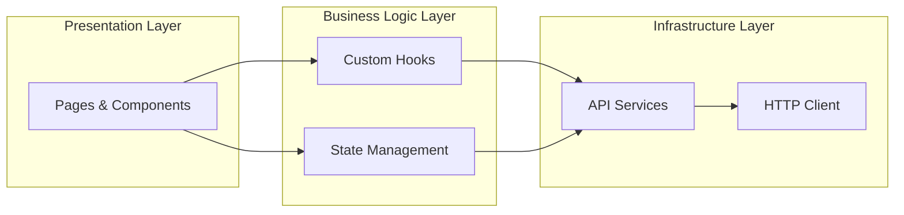
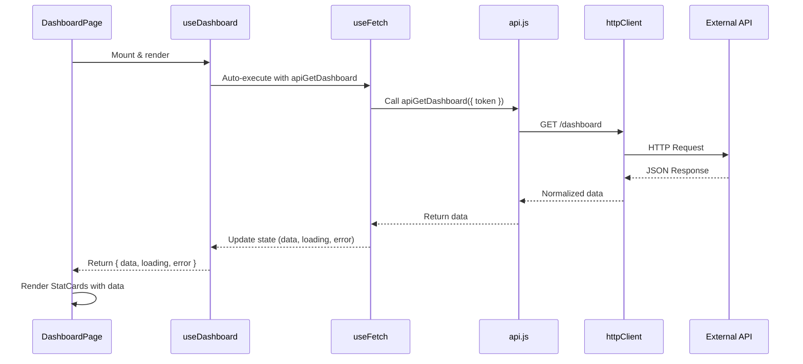

## System Architecture

APM Enterprise follows a **three-layer vertical architecture** designed to eliminate coupling between UI and data, transforming a monolithic application into a modular, scalable, and professional software ecosystem.



## Architecture Layers

### 1. Presentation Layer

The presentation layer consists of **atomic components** and pages that focus purely on rendering. Components are agnostic to business logic and data fetching:

- **Components**: StatCard, Card, Badge, Button, TextField, Select
- **Pages**: DashboardPage, ProjectsPage, UsersPage
- **Responsibility**: UI rendering only, no data fetching or business rules

<Note>
  Components in the presentation layer are "pure" - they only render properties passed to them and trigger callbacks. They don't know how to fetch data or manage state.
</Note>

### 2. Business Logic Layer

Custom hooks encapsulate all business logic, state management, and async operations:

- **Hooks**: `useFetch`, `useForm`, `useDashboard`, `useProjectForm`, `useUsers`, `useToggle`
- **Responsibility**: State management, data transformation, validation, UI behavior coordination

### 3. Infrastructure Layer

The service layer handles all external communication and data persistence:

- **Services**: `httpClient`, `apiClient`, `api.js`
- **Responsibility**: HTTP requests, error handling, data normalization, API abstraction

## Separation of Concerns (SoC)

The architecture strictly enforces separation of concerns to ensure that changes in one layer don't affect others:

<AccordionGroup>
  <Accordion title="Key Achievements">
    1. **Elimination of Fetch in UI**: Pages no longer know how to retrieve data
    2. **Modularization**: Each file has a single responsibility (SRP)
    3. **UI Agnostic**: Components can be reused in any section of the system
    4. **65% Code Reduction**: Custom hooks eliminated duplicated code across pages
  </Accordion>

  <Accordion title="Benefits">
    - **Testability**: Each layer can be tested independently
    - **Maintainability**: Changes to API don't require UI changes
    - **Scalability**: New features can be added without affecting existing code
    - **Reusability**: Components and hooks can be shared across the application
  </Accordion>
</AccordionGroup>

## Development Phases

APM Enterprise was developed in three strategic phases:

### Phase 1: Structural Foundations

**Objective**: Transform monolithic "all-in-one" application into modular ecosystem

- Fragmented UI into atomic components
- Applied vertical layer architecture
- Eliminated coupling between UI and data

<CodeGroup>
```jsx Before - Monolithic Approach
function DashboardPage() {
  const [data, setData] = useState(null);
  const [loading, setLoading] = useState(false);
  
  useEffect(() => {
    fetch('/api/dashboard')
      .then(res => res.json())
      .then(setData);
  }, []);
  
  // 200+ lines of mixed UI and logic...
}
```

```jsx After - Layered Approach
function DashboardPage() {
  const { data, loading, error } = useDashboard();
  
  return (
    <div>
      {loading ? <Skeleton /> : <StatCard {...data.stats} />}
    </div>
  );
}
```
</CodeGroup>

### Phase 2: Senior Logic & Custom Hooks

**Objective**: Abstract repetitive patterns into reusable tools

- Designed universal request engine (`useFetch`)
- Created form management abstraction (`useForm`)
- Implemented atomic state control for loading, data, and errors
- Achieved 65% reduction in duplicated code

See [Custom Hooks](/architecture/custom-hooks) for detailed implementation.

### Phase 3: Premium Refinement & API Integrity

**Objective**: Elevate to enterprise-level with real external APIs

- Integrated JSONPlaceholder for real async data flows
- Implemented silent logging system for auditing
- Created network failure simulator for resilience testing
- Added error interception with visual feedback

See [API Layer](/architecture/api-layer) for integration details.

## Data Flow Example

Here's how data flows through the three layers when loading dashboard statistics:



<Tip>
  This layered flow ensures that if the API changes, only the `api.js` service needs updating. The UI and hooks remain completely unchanged.
</Tip>

## File Structure

The architecture is reflected in the file organization:

```
src/
├── components/          # Presentation Layer
│   ├── StatCard.jsx
│   ├── Card.jsx
│   ├── Badge.jsx
│   ├── Button.jsx
│   └── TextField.jsx
├── hooks/              # Business Logic Layer
│   ├── useFetch.js
│   ├── useForm.js
│   ├── useDashboard.js
│   ├── useProjectForm.js
│   ├── useUsers.js
│   └── useToggle.js
├── services/           # Infrastructure Layer
│   ├── httpClient.js
│   ├── apiClient.js
│   └── api.js
└── pages/              # Application Routes
    ├── DashboardPage.jsx
    ├── ProjectsPage.jsx
    └── UsersPage.jsx
```

## Next Steps

<CardGroup cols={2}>
  <Card title="Component Structure" icon="cubes" href="/architecture/component-structure">
    Learn about atomic component design and usage patterns
  </Card>
  <Card title="Custom Hooks" icon="link" href="/architecture/custom-hooks">
    Explore the business logic layer and hook implementations
  </Card>
  <Card title="API Layer" icon="cloud" href="/architecture/api-layer">
    Understand service architecture and error handling
  </Card>
  <Card title="Getting Started" icon="rocket" href="/quickstart">
    Start building with APM Enterprise
  </Card>
</CardGroup>