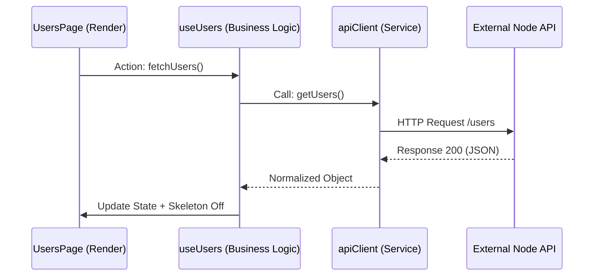
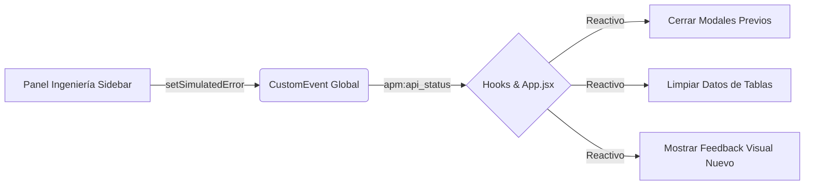

## Overview

APM Enterprise implements an **Active Network Audit Protocol** that tracks all API interactions, monitors error states, and provides comprehensive logging for debugging and compliance purposes.

<Info>
  The audit system is designed for enterprise-grade debugging without sacrificing the minimalist frontend aesthetic.
</Info>

## Error Response Matrix

The system categorizes all HTTP responses into four primary states with distinct behavioral protocols:

| Code | Technical Status | System Behavior | Visual Feedback |
|------|------------------|-----------------|------------------|
| **200** | **SUCCESS** | Restores data flow immediately | Emerald modal with auto-dismiss |
| **401** | **AUTH FAIL** | Clears local cache, notifies session expiration | Violet modal |
| **404** | **NOT FOUND** | Renders resource-specific empty state | Blue modal |
| **500** | **CORE FAIL** | Triggers emergency protocol, clears tables | Red modal |

### Response Matrix Implementation

From the project documentation (`docs/FASE_3_PREMIUM.md:54-61`):

```markdown
### Matriz de Respuesta a Errores
| Código | Estado Técnico | Comportamiento del Sistema | Visual (Modal) |
| :--- | :--- | :--- | :--- |
| **200** | **SUCCESS** | Restaura flujos de datos inmediatamente. | **Esmeralda** |
| **401** | **AUTH FAIL** | Limpia caché local y notifica expiración de sesión. | **Violeta** |
| **404** | **NOT FOUND** | Renderiza "Empty State" específico del recurso. | **Azul** |
| **500** | **CORE FAIL** | Dispara protocolo de emergencia y limpia tablas. | **Rojo** |
```

## Audit Protocol Architecture

The audit system follows a layered event-driven architecture:



### Service Layer Logging

The `apiClient` service logs all API responses to the browser console:

```javascript
export const apiClient = {
  async getUsers() {
    try {
      const response = await fetch(`${USERS_BASE_URL}/users`);
      if (!response.ok) {
        const error = new Error("Error al obtener usuarios");
        error.status = response.status;
        throw error;
      }
      const data = await response.json();
      console.log("Users Data:", data);
      return data;
    } catch (err) {
      throw err;
    }
  },

  async getUserPosts(userId) {
    const response = await fetch(`${USERS_BASE_URL}/posts?userId=${userId}`);
    if (!response.ok) throw new Error("Error al obtener posts");
    const data = await response.json();
    console.log(`Posts (User ${userId}):`, data);
    return data;
  },

  async getPostComments(postId) {
    const response = await fetch(`${USERS_BASE_URL}/comments?postId=${postId}`);
    if (!response.ok) throw new Error("Error al obtener comentarios");
    const data = await response.json();
    console.log(`Comments (Post ${postId}):`, data);
    return data;
  }
};
```

<Note>
  All API responses are logged with structured console output for easy debugging. Open DevTools (F12) to view the audit trail.
</Note>

## CustomEvent System (apm:api_status)

The core of the audit protocol is the `apm:api_status` CustomEvent that propagates error states throughout the application.

### Event Flow



### Event Structure

The CustomEvent carries a standardized payload:

```javascript
const event = new CustomEvent('apm:api_status', {
  detail: {
    code: 500,  // HTTP status code
    message: "Internal Server Error"  // Human-readable message
  }
});
```

### Event Listener Implementation

From `src/App.jsx:12-22`:

```javascript
useEffect(() => {
  const handleApiStatus = (e) => {
    const { code, message } = e.detail;
    // Clear previous modal state
    setErrorModal({ isOpen: false, code: null, message: "" });
    // Delayed re-open for animation reset
    setTimeout(() => {
      setErrorModal({ isOpen: true, code, message });
    }, 50);
  };
  window.addEventListener("apm:api_status", handleApiStatus);
  return () => window.removeEventListener("apm:api_status", handleApiStatus);
}, []);
```

<Warning>
  The 50ms delay between modal close/open is critical for CSS animation reset. Do not remove this timing.
</Warning>

## Error Propagation Flow

When an error occurs (real or simulated), it propagates through the application in the following sequence:

<Steps>
  <Step title="Error Detection">
    Error is detected at the service layer (API call failure) or triggered via simulation panel.
  </Step>

  <Step title="Event Dispatch">
    `apm:api_status` CustomEvent is dispatched to `window` with error details.
  </Step>

  <Step title="State Update">
    App.jsx listener catches event and updates `errorModal` state.
  </Step>

  <Step title="UI Reaction">
    - ErrorModal component renders with error-specific styling
    - Data tables clear (for 500 errors)
    - Empty states render (for 404 errors)
    - Cache cleared (for 401 errors)
  </Step>

  <Step title="User Feedback">
    Modal appears in bottom-right corner with contextual icon, color, and message.
  </Step>
</Steps>

## Silent Logging System

From the project documentation (`docs/FASE_3_PREMIUM.md:24-28`):

> Para cumplir con requisitos de auditoría profunda sin sacrificar la estética minimalista del frontend, se integró un sistema de **Logging Silencioso**:
>
> 1. **Fuga de Datos**: Al inspeccionar un perfil, el sistema dispara llamadas a `/posts` y `/comments`.
> 2. **Visualización**: Los resultados se agrupan en la consola del navegador (`F12`) usando `console.group`, mostrando tablas técnicas de la actividad del usuario.

This approach ensures:
- Zero UI clutter from debug information
- Full audit trail in browser DevTools
- Structured, searchable console output
- Production-ready logging architecture

## Centralized HTTP Error Handling

The `httpClient` service provides a single point of error handling:

```javascript
async function handleResponse(response) {
  if (!response.ok) {
    const errorData = await response.json().catch(() => ({}));
    const error = new Error(errorData.message || "Error de comunicación con el servidor");
    error.status = response.status;
    throw error;
  }
  return response.json();
}

export const httpClient = {
  async get(endpoint, options = {}) {
    const response = await fetch(`${BASE_URL}${endpoint}`, {
      method: 'GET',
      headers: getHeaders(options.headers),
    });
    return handleResponse(response);
  },
  // ... other methods
};
```

### Benefits of Centralized Handling

- **Consistency**: All errors follow the same format
- **Maintainability**: Single location for error logic updates
- **Observability**: Centralized logging point
- **Testability**: Mock responses in one place

<Info>
  Custom hooks consume the httpClient and transform errors into user-friendly messages before dispatching events.
</Info>

## Debugging Best Practices

1. **Enable Console Logging**
   - Open DevTools (F12)
   - Navigate to Console tab
   - Watch for structured API response logs

2. **Use Error Simulation**
   - Test each error code (401, 404, 500)
   - Verify modal appearance and behavior
   - Confirm data state changes

3. **Monitor Network Tab**
   - Check request/response headers
   - Validate payload structure
   - Inspect timing and performance

4. **Trace Event Flow**
   - Add breakpoints in event listeners
   - Step through state updates
   - Verify cleanup on unmount

## Integration with External APIs

APM Enterprise integrates with JSONPlaceholder for real-world API testing:

```javascript
const USERS_BASE_URL = "https://jsonplaceholder.typicode.com";
```

This allows:
- Testing with live HTTP endpoints
- Realistic network latency simulation
- Complex data relationships (users → posts → comments)

<Note>
  The JSONPlaceholder API is read-only and always returns 200 responses. Use the simulation panel to test error states.
</Note>

## Next Steps

- Review [Error Simulation](/development/error-simulation) for testing workflows
- Implement custom audit hooks for new features
- Extend the error matrix with additional status codes
- Add telemetry integration for production monitoring